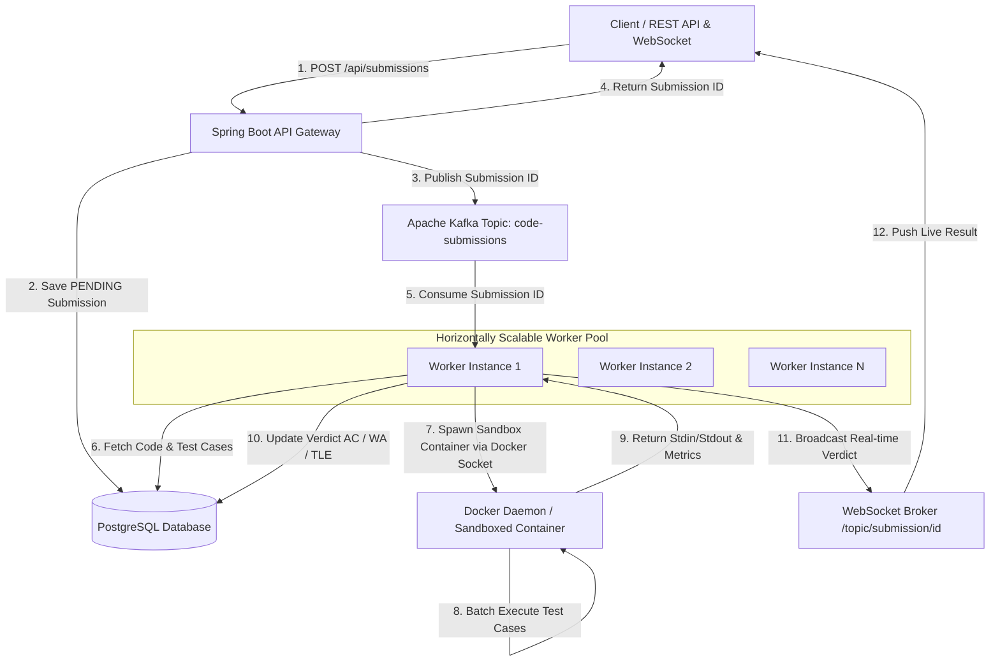

# JudgeX Backend Engine: Ultimate Interview & Architectural Guide

Welcome to the comprehensive engineering guide for the **JudgeX Online Code Judge Backend**. This document is specifically structured to help you master the internal architecture, explain design trade-offs confidently in technical interviews, answer tough "Why X instead of Y?" cross-questions, and serve as a blueprint if you build a distributed coding sandbox from scratch.

---

## Table of Contents
1. [High-Level System Architecture & Workflow](#1-high-level-system-architecture--workflow)
2. [Core Interview Cross-Questions ("Why This, Not That?")](#2-core-interview-cross-questions-why-this-not-that)
3. [Complete File-by-File Backend Breakdown](#3-complete-file-by-file-backend-breakdown)
4. [Docker & Infrastructure Deep Dive](#4-docker--infrastructure-deep-dive)
5. [REST API & WebSocket Endpoints Reference](#5-rest-api--websocket-endpoints-reference)
6. [Step-by-Step Roadmap to Build From Scratch](#6-step-by-step-roadmap-to-build-from-scratch)

---

## 1. High-Level System Architecture & Workflow

JudgeX is designed as an **asynchronous, horizontally scalable, distributed code execution platform**. When thousands of users submit code simultaneously during a competitive contest, synchronous execution would freeze HTTP server threads and crash the system. 

### Architecture Diagram



### The End-to-End Execution Lifecycle:
1. **Submission Ingestion**: The user sends code, language choice, and problem ID to `POST /api/submissions`.
2. **Database Transaction & Hook**: The Spring Boot API creates a `Submission` entity with `PENDING` status and saves it to PostgreSQL. Using Spring's `TransactionSynchronizationManager`, we register an `afterCommit` hook. Only *after* the PostgreSQL transaction successfully commits do we push the submission ID to the **Apache Kafka** topic (`code-submissions`).
3. **Asynchronous Worker Consumption**: Independent worker nodes (scaled via `docker compose --scale worker=N`) listen to Kafka. A worker pulls the ID, queries PostgreSQL for the code and test cases, and transitions status to `RUNNING`.
4. **Sandboxed Docker Batch Processing**: The worker invokes `AbstractDockerExecutor`. It creates a temporary scratch directory on the host containing the source code and all test case input files. It invokes a ephemeral Docker container (`openjdk:17`, `python:3.11`, or `gcc:12`) with strict CPU, memory, and network restrictions.
5. **Short-Circuit Evaluation**: Inside the container, test cases run sequentially. If Test Case #1 passes, it moves to Test Case #2. If Test Case #2 fails (e.g., Wrong Answer or Time Limit Exceeded), execution **short-circuits immediately**, discarding remaining test cases to save CPU cycles.
6. **Live Verdict Broadcast**: The worker parses stdout/stderr, evaluates the final verdict (`ACCEPTED`, `WRONG_ANSWER`, `TIME_LIMIT_EXCEEDED`, `COMPILATION_ERROR`, `MEMORY_LIMIT_EXCEEDED`, or `RUNTIME_ERROR`), updates PostgreSQL, and broadcasts the verdict over WebSockets (`/topic/submission/{id}`).

---

## 2. Core Interview Cross-Questions ("Why This, Not That?")

When interviewing for backend or systems design roles, interviewers care less about what code you wrote and more about **why you chose specific architectural patterns**. Here are the exact answers to nail these questions:

### Q1: Why execute code inside Docker containers instead of running directly on the host JVM/OS?
* **Security & Isolation**: Untrusted user code could execute malicious system calls (e.g., `rm -rf /`, fork bombs `:(){ :|:& };:`, or reading environment variables containing database passwords). Docker containers provide filesystem isolation and namespaces.
* **Network Blocking**: We pass `--network none` to Docker. This prevents users from writing code that pings internal servers, launches DDoS attacks, or downloads external unauthorized scripts.
* **Resource Limiting (cgroups)**: We enforce `--memory=256m` and `--cpus=1.0`. If a user writes an infinite loop that consumes RAM, Linux cgroups kill the container without affecting the host server or other users' evaluations.
* **Environment Consistency**: No need to install multiple competing compiler versions on the host machine. Each language runs in its official, reproducible Docker image.

### Q2: Why use Apache Kafka instead of RabbitMQ, Redis Pub/Sub, or Java In-Memory BlockingQueues?
* **Why NOT In-Memory Queues (e.g., `ArrayBlockingQueue`)?** If the Spring Boot application crashes or restarts during a deployment, all queued submissions stored in JVM memory are **permanently lost**. Furthermore, an in-memory queue cannot be shared across multiple physical servers.
* **Why NOT Redis Pub/Sub?** Redis Pub/Sub is fire-and-forget. If all execution workers are temporarily offline or rebooting, messages sent to Redis Pub/Sub are lost.
* **Why Apache Kafka over RabbitMQ?** 
  1. **Log Persistence & Replayability**: Kafka persists messages to disk. If the database drops momentarily, we can replay the Kafka offset to re-judge submissions without asking users to re-submit.
  2. **Horizontal Scaling via Consumer Groups**: All worker instances belong to the same Kafka Consumer Group (`judge-group`). Kafka automatically distributes topic partitions across active workers. When we run `docker compose up --scale worker=4`, Kafka dynamically rebalances the load across all 4 workers with zero code changes.
  3. **High Throughput**: Kafka handles hundreds of thousands of messages per second with minimal latency, making it ideal for high-concurrency coding competitions.

### Q3: Why run Docker in "Batch Mode" (1 container per submission) instead of spinning up a new Docker container for *every single test case*?
* **The Startup Overhead Problem**: Spawning a Docker container (`docker run`) involves creating network namespaces, mounting root filesystems, and initializing the JVM/Python interpreter. This takes approximately **300ms to 500ms** per container startup.
* **The Math**: If a problem has **100 test cases**, creating a separate Docker container for each test case would take `100 * 400ms = 40,000ms (40 seconds)` just in overhead—guaranteeing a Time Limit Exceeded (TLE) error!
* **The Batch Solution**: In JudgeX, we create **exactly 1 container per submission**. We write all 100 test case input files to a mounted volume (`/tmp/judge/...`). The container compiles the code once, loops through all test cases internally (or via a fast wrapper script), and outputs results. Total execution time drops from **40 seconds to ~200 milliseconds**!

### Q4: Why short-circuit evaluation on the first test case failure?
* In competitive programming (like Codeforces or LeetCode), a submission is only `ACCEPTED` if it passes **100% of test cases**. 
* If a user's code fails on Test Case #2 (out of 50), running Test Cases #3 through #50 provides no additional value for the final verdict. By short-circuiting immediately upon failure, we free up worker CPU threads to evaluate other users' submissions **50x faster**.

### Q5: How do you accurately detect Time Limit Exceeded (TLE) without hanging the backend worker thread?
* We use a two-layered defense:
  1. **Java Asynchronous Futures**: In Java, we wrap the process execution inside a `CompletableFuture` and invoke `.get(timeLimitMs + BUFFER, TimeUnit.MILLISECONDS)`. If the code doesn't finish within the limit, Java throws a `TimeoutException`.
  2. **Docker `--stop-timeout` and `destroy()`**: Upon catching a `TimeoutException`, the worker explicitly terminates the process and invokes `docker kill <container_id>`. This ensures infinite loops are ruthlessly murdered at the OS kernel level.

### Q6: What is the Docker-out-of-Docker (DooD) pattern used in docker-compose?
* In our `docker-compose.yml`, the `worker` service binds the host Docker socket: `- /var/run/docker.sock:/var/run/docker.sock`.
* Instead of running Docker *inside* a container (Docker-in-Docker, which requires privileged mode and causes filesystem corruption), DooD allows the worker container to communicate directly with the host machine's Docker daemon. When the worker calls `docker run openjdk:17`, the host Docker daemon spawns a sibling container alongside the worker, keeping overhead minimal and secure.

---

## 3. Complete File-by-File Backend Breakdown

Here is a comprehensive breakdown of every file and package in the Java Spring Boot backend (`src/main/java/com/codejudge/`), explaining **what** it does and **why** it is built that way.

```
com.codejudge/
├── OnlineCodeJudgeApplication.java      # Main Spring Boot Application Bootstrapper
├── auth/                                # Authentication & User Identity Domain
│   ├── User.java                        # JPA Entity for users (id, username, passwordHash, role)
│   ├── UserRepository.java              # Spring Data JPA repository for user DB operations
│   ├── AuthService.java                 # Business logic: BCrypt password hashing, user registration/login
│   ├── AuthController.java              # REST endpoints: POST /api/auth/register, /login, GET /me
│   └── JwtUtil.java                     # Utility for signing and validating stateless JSON Web Tokens (HMAC-SHA256)
├── config/                              # System Configuration & Security
│   ├── SecurityConfig.java              # Spring Security filter chain: CORS, CSRF disable, JWT authorization filter
│   ├── KafkaConfig.java                 # KafkaProducer & KafkaConsumer factory beans, JSON/String serialization
│   ├── WebSocketConfig.java             # STOMP message broker setup: /ws endpoint, /topic destination prefix
│   ├── ProblemGenerator.java            # Seed data logic: generates HTML descriptions, edge cases, programmatic tests
│   └── DataSeeder.java                  # CommandLineRunner: populates DB on startup with problems and demo accounts
├── problem/                             # Coding Challenges Domain
│   ├── Difficulty.java                  # Enum: EASY, MEDIUM, HARD
│   ├── Problem.java                     # JPA Entity: title, description, timeLimitMs, memoryLimitMb
│   ├── TestCase.java                    # JPA Entity: input, expectedOutput, isHidden (public sample vs private test)
│   ├── ProblemRepository.java           # JPA repository with custom queries (e.g., findWithTestCasesById)
│   ├── ProblemService.java              # Business logic: fetches problems, strips hidden test cases for regular users
│   └── ProblemController.java           # REST endpoints: GET /api/problems, GET /api/problems/{id}
├── submission/                          # Submissions & History Domain
│   ├── Language.java                    # Enum: JAVA, PYTHON, CPP
│   ├── SubmissionStatus.java            # Enum: PENDING, RUNNING, ACCEPTED, WRONG_ANSWER, TLE, COMPILE_ERROR, etc.
│   ├── Submission.java                  # JPA Entity: code, language, status, runtimeMs, memoryMb, passedTestCases
│   ├── SubmissionRequest.java           # DTO Record: problemId, code, language, sampleOnly flag
│   ├── SubmissionResponse.java          # DTO Record: formatted verdict data sent to UI and WebSockets
│   ├── SubmissionRepository.java        # JPA repository: queries user history, filters out sampleOnly evaluations
│   ├── SubmissionService.java           # Business logic: saves PENDING submission, registers transaction commit hook
│   └── SubmissionController.java        # REST endpoints: POST /api/submissions, GET /api/submissions/mine
├── execution/                           # Core Execution Engine & Sandboxing (The Heart of JudgeX)
│   ├── ExecutionResult.java             # Record: exitCode, stdout, stderr, execution metrics (runtime, ram, cpu)
│   ├── LanguageExecutor.java            # Strategy Interface: executeBatch(submission, problem, inputs)
│   ├── ExecutorFactory.java             # Factory: returns JavaExecutor, PythonExecutor, or CppExecutor by Enum
│   ├── AbstractDockerExecutor.java      # Core Sandboxing Engine: file I/O, docker CLI command builder, metrics parsing
│   ├── JavaExecutor.java                # Concrete strategy: javac compilation, java execution command setup
│   ├── PythonExecutor.java              # Concrete strategy: python3 execution command setup
│   ├── CppExecutor.java                 # Concrete strategy: g++ compilation, binary execution setup
│   ├── VerdictEvaluator.java            # Verdict Logic: compares stdout vs expected, handles trailing spaces/newlines
│   └── WorkerManager.java               # Orchestrator: pulls job, coordinates execution, updates DB, emits WebSocket
└── resilience/                          # Fault Tolerance & Reliability
    └── DeadLetterConsumer.java          # Kafka Listener: consumes code-submissions, handles retries & DLQ fallback
```

### Detailed Deep-Dive into Critical Classes:

#### 1. `SubmissionService.java`
* **Why it's critical**: Bridges HTTP requests with asynchronous background execution.
* **Key Implementation Detail**:
  ```java
  Submission saved = submissionRepository.save(submission);
  Runnable dispatch = () -> {
      if (kafkaEnabled) {
          kafkaTemplate.send(submissionsTopic, saved.getId().toString());
      } else {
          workerManager.executeAsync(saved.getId());
      }
  };
  // CRITICAL INTERVIEW POINT: Transaction Synchronization Hook
  if (TransactionSynchronizationManager.isSynchronizationActive()) {
      TransactionSynchronizationManager.registerSynchronization(new TransactionSynchronization() {
          @Override
          public void afterCommit() {
              dispatch.run();
          }
      });
  } else {
      dispatch.run();
  }
  ```
* **Why do we use `afterCommit()`?** If we send the `submissionId` to Kafka *before* the database transaction commits, a fast Kafka worker might consume the ID and query PostgreSQL immediately. Since the transaction hasn't committed yet, PostgreSQL returns `EntityNotFoundException: Submission not found`! The `afterCommit` hook guarantees Kafka only hears about the submission after the database row is locked and saved.

#### 2. `AbstractDockerExecutor.java`
* **Why it's critical**: This is the sandbox container engine that protects the host OS and implements fast batching.
* **How Batching Works**:
  1. Creates a unique temporary folder on host: `/tmp/judge/{submissionId}/`.
  2. Writes user code to `Solution.java`, `solution.py`, or `main.cpp`.
  3. Writes every test case input to separate files: `in_0.txt`, `in_1.txt`, ..., `in_N.txt`.
  4. Spawns Docker container mounting this folder: `docker run --rm -v /tmp/judge/{id}:/workspace -w /workspace ...`
  5. Executes compilation (if Java/C++) and iterates over all test cases, writing outputs to `out_0.txt`, `out_1.txt`, etc., along with a `time.log` capturing CPU and RAM utilization.
  6. Reads output files back into Java memory, cleans up the temporary folder (`deleteRecursively`), and returns the results.

#### 3. `VerdictEvaluator.java`
* **Why it's critical**: Determines whether code is correct.
* **How it handles edge cases**: In competitive programming, a user might print `"3\n\n"` while expected output is `"3"`. A naive string equality check (`stdout.equals(expected)`) would fail unfairly. `VerdictEvaluator` strips trailing whitespace from every line and normalizes line endings (`\r\n` to `\n`) before comparison. It also inspects exit codes: non-zero exit codes map to `RUNTIME_ERROR` or `TIME_LIMIT_EXCEEDED`.

#### 4. `WorkerManager.java`
* **Why it's critical**: Coordinates the workflow on worker nodes.
* **Real-time UI updates**: Before execution starts, it sets status to `RUNNING` and calls `webSocketHandler.publish(submission)`. As soon as evaluation concludes, it calls `applyFinal(...)`, updates PostgreSQL, and fires another WebSocket broadcast so the user sees their badge flip to `ACCEPTED` instantly without refreshing the browser.

---

## 4. Docker & Infrastructure Deep Dive

### 1. Backend `Dockerfile`
The backend Dockerfile packages our Spring Boot application and installs the Docker CLI so that workers can communicate with the Docker socket.

```dockerfile
# Multi-stage or standard JDK build
FROM eclipse-temurin:17-jdk-jammy
WORKDIR /app

# Install Docker CLI so worker containers can run 'docker run' commands via host socket
RUN apt-get update && apt-get install -y docker.io && rm -rf /var/lib/apt/lists/*

# Copy maven build artifact
COPY target/online-code-judge-0.0.1-SNAPSHOT.jar app.jar

# Expose API port
EXPOSE 8080
ENTRYPOINT ["java", "-jar", "app.jar"]
```

### 2. `docker-compose.yml` Architecture
Our `docker-compose.yml` orchestrates the distributed infrastructure:
1. **`postgres`**: Relational database storing users, problems, test cases, and submission records.
2. **`zookeeper` & `kafka`**: The distributed message broker managing the submission queue.
3. **`app` (API Gateway)**: Runs Spring Boot with Kafka producer mode enabled (`APP_KAFKA_ENABLED=true`). Serves REST APIs and WebSocket connections on port `8080`.
4. **`worker` (Execution Pool)**: Runs Spring Boot in worker mode. Crucially, notice the volume mount:
   ```yaml
   volumes:
     - /var/run/docker.sock:/var/run/docker.sock
     - /tmp/judge:/tmp/judge
   ```
   * **Why `/var/run/docker.sock`?** Enables Docker-out-of-Docker (DooD). The worker instructs the host Docker daemon to create execution sandboxes.
   * **Why share `/tmp/judge:/tmp/judge`?** When the worker creates temporary source files in `/tmp/judge/123`, the host machine must see the exact same filepath so it can mount `/tmp/judge/123` into the ephemeral language container (`openjdk:17`, etc.).

---

## 5. REST API & WebSocket Endpoints Reference

### Authentication Endpoints (`AuthController.java`)
| Method | Endpoint | Description | Request Body / Params | Response |
| :--- | :--- | :--- | :--- | :--- |
| `POST` | `/api/auth/register` | Register new user account | `{"username": "...", "password": "...", "email": "..."}` | `{"token": "jwt...", "username": "...", "role": "USER"}` |
| `POST` | `/api/auth/login` | Authenticate user & get JWT | `{"username": "...", "password": "..."}` | `{"token": "jwt...", "username": "...", "role": "USER"}` |
| `GET` | `/api/auth/me` | Get current user profile | Header: `Authorization: Bearer <token>` | `{"id": 1, "username": "...", "role": "USER"}` |

### Problem Endpoints (`ProblemController.java`)
| Method | Endpoint | Description | Request Body / Params | Response |
| :--- | :--- | :--- | :--- | :--- |
| `GET` | `/api/problems` | List all available coding challenges | Optional: `?page=0&size=20` | Page of problems (without hidden test cases) |
| `GET` | `/api/problems/{id}` | Get problem details & public samples | Path Variable: `id` | Problem object with HTML description & public sample test cases |
| `POST` | `/api/problems` *(Admin)* | Create new problem | `{"title": "...", "description": "...", "testCases": [...]}` | Created Problem entity |

### Submission Endpoints (`SubmissionController.java`)
| Method | Endpoint | Description | Request Body / Params | Response |
| :--- | :--- | :--- | :--- | :--- |
| `POST` | `/api/submissions` | Submit code for evaluation | `{"problemId": 1, "language": "JAVA", "code": "...", "sampleOnly": false}` | `{"id": 42, "status": "PENDING", ...}` |
| `GET` | `/api/submissions/{id}` | Poll submission status | Path Variable: `id` | Detailed submission verdict and execution metrics |
| `GET` | `/api/submissions/mine` | Get current user's history | Optional: `?page=0&size=15` | Page of submissions (filters out `sampleOnly` runs) |

### Real-Time WebSocket Broker (`WebSocketConfig.java`)
* **Connection URL**: `ws://localhost:8080/ws` (using SockJS & STOMP protocol).
* **Subscription Destination**: `/topic/submission/{id}`
* **Payload Broadcasted**: Whenever a submission transitions to `RUNNING` or reaches a terminal verdict (`ACCEPTED`, `WRONG_ANSWER`, etc.), the server pushes the JSON representation of `SubmissionResponse` to all subscribers subscribed to that submission ID.

---

## 6. Step-by-Step Roadmap to Build From Scratch

If you want to build this distributed online code judge yourself from scratch, follow this phased architectural development plan:

### Phase 1: Core Domain & CRUD API Foundation
1. **Initialize Spring Boot Project**: Include dependencies for Spring Web, Spring Data JPA, PostgreSQL Driver, Spring Security, Lombok, and Validation.
2. **Design Database Schema**: Create entities for `User`, `Problem`, `TestCase`, and `Submission`. Enforce `@OneToMany` relationships between Problem and TestCase.
3. **Implement JWT Security**: Write a custom `JwtAuthenticationFilter` that validates Bearer tokens on incoming requests and injects the authenticated `User` into Spring's `SecurityContextHolder`.
4. **Build REST Controllers**: Create endpoints to list problems, view problem descriptions, and register accounts.

### Phase 2: Local In-Memory Execution Engine
1. **Strategy Pattern Setup**: Define a `LanguageExecutor` interface with a method `executeBatch(...)`. Create concrete classes: `JavaExecutor`, `PythonExecutor`, `CppExecutor`.
2. **ProcessBuilder Execution**: Start without Docker. Use Java's `ProcessBuilder` to execute `javac`, `java`, `python3`, or `g++` directly on your local operating system.
3. **File I/O Handling**: Write helper functions to generate temporary directories (`/tmp/judge/{id}`), dump code to disk, feed input streams, and read output streams.
4. **Implement Verdict Logic**: Write `VerdictEvaluator` to compare stdout against expected output, trimming trailing spaces and catching non-zero process exit codes.

### Phase 3: Sandboxed Docker Execution & Batching Optimization
1. **Dockerize Execution**: Replace local `ProcessBuilder` commands with `docker run --rm -v ... -w ... --network none --memory=256m --cpus=1.0 <image> <cmd>`.
2. **Solve Container Overhead (Batching)**: Modify the executor so it only launches **1 container per submission**. Write all test case inputs to disk beforehand and process them in a single container run.
3. **Enforce Timeouts**: Wrap execution in Java `CompletableFuture.get(timeLimit, TimeUnit.MILLISECONDS)`. If a timeout occurs, run a system call to `docker kill` the runaway container and assign `TIME_LIMIT_EXCEEDED`.

### Phase 4: Asynchronous Scaling with Apache Kafka & Worker Pools
1. **Integrate Kafka**: Add Spring Kafka dependencies. Configure a producer in `SubmissionService` to publish submission IDs after database transactions commit (`afterCommit` hook).
2. **Create Worker Pool**: Create a Kafka listener (`@KafkaListener(topics = "code-submissions")`) in `WorkerManager` that consumes submission IDs and triggers `executeSubmission(...)`.
3. **Docker-out-of-Docker Setup**: Create a Dockerfile and `docker-compose.yml`. Mount `/var/run/docker.sock` so containers can spawn sibling sandbox containers. Test horizontal scaling using `docker compose up --scale worker=3`.

### Phase 5: Real-Time Feedback with WebSockets
1. **Enable WebSockets**: Add Spring Boot WebSocket starter. Configure STOMP messaging broker in `WebSocketConfig`.
2. **Publish Events**: In `WorkerManager`, inject `SimpMessagingTemplate` (or custom handler). When a job starts or finishes, call `template.convertAndSend("/topic/submission/" + id, response)`.
3. **End-to-End Testing**: Submit code with infinite loops, syntax errors, and optimal solutions to verify real-time UI updates, resource throttling, and zero-gap database archiving!
