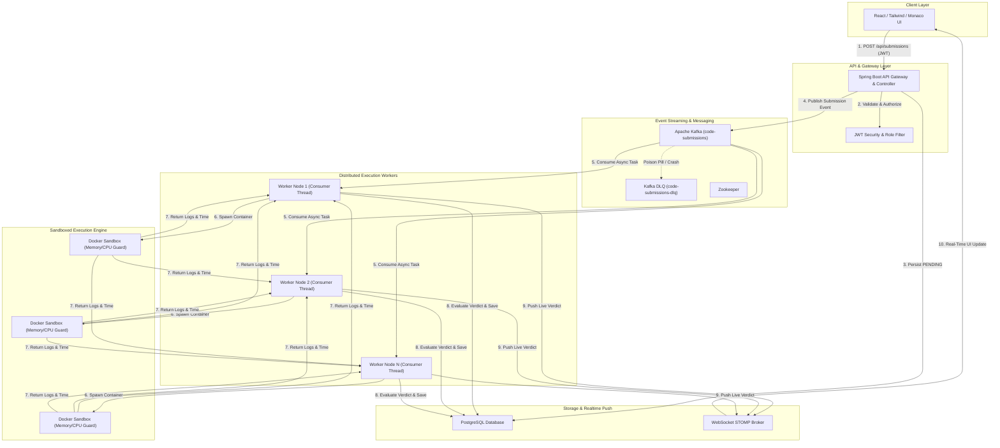

# JudgeX - Online Code Judge

**JudgeX** is a high-performing, distributed code execution engine and API designed to power online coding platforms and algorithmic evaluators. Built with Spring Boot, Apache Kafka, and Docker, it asynchronously compiles, runs, and evaluates untrusted user code (Java, Python, and C++) against rigorous test cases and strict CPU/memory limits.

While JudgeX is architected primarily as a standalone backend engine and API for other services to integrate with, it includes a lightweight React frontend to visually demonstrate and showcase its real-time evaluation capabilities.

---

## 💡 Why I Built This?

I wanted to understand how platforms like LeetCode, Codeforces, and HackerRank execute untrusted code across thousands of test cases so fast and securely behind the scenes. I also wanted a project that truly challenges and showcases my backend system design and infrastructure engineering skills. This is why I built JudgeX.

### Core Features & How It Works:
* **Asynchronous Execution Queue**: Uses Apache Kafka as a high-throughput message broker to ingest incoming code submissions and distribute evaluation tasks across scalable worker pools, preventing intensive compilation jobs from blocking the REST API.
* **Hardened Docker Sandboxing**: Every submission is executed inside an ephemeral, isolated Docker container with zero network access (`--network=none`), memory and CPU limits, a read-only root filesystem, and dropped Linux kernel capabilities (`--cap-drop=ALL`).
* **High-Precision Algorithmic Timing**: Measures execution speed directly inside the container shell using POSIX nanosecond timestamps—completely isolating algorithm runtime from JVM startup or compiler overhead to guarantee fair time limit evaluation.
* **Real-Time WebSocket Push**: Leverages STOMP over WebSockets to broadcast live execution state transitions (`PENDING` -> `RUNNING` -> `ACCEPTED` / `TLE` / `WA`) instantly to connected clients without REST polling.
* **Fault Tolerance & DLQ**: Implements a Kafka Dead Letter Queue (DLQ) pattern to catch crashing container processes, poison pills, and system faults without stopping worker threads or crashing the consumer group.

---

## 🏗️ System Architecture



---

## 📦 Backend Modules

- `auth`: Handles user registration, login, JWT token generation/validation, BCrypt password hashing, and role permissions (`USER`, `ADMIN`).
- `problem`: CRUD operations for coding problems, sample/hidden test cases, pagination, difficulty sorting, and startup data seeding.
- `submission`: Handles code submission ingestion, history retrieval, and user submission tracking.
- `execution`: Kafka consumer listener, worker manager, language executor factories, container runner, and verdict evaluator.
- `resilience`: Dead Letter Queue (DLQ) consumer service that traps unhandled exceptions and flags failing payloads as `SYSTEM_ERROR`.
- `realtime`: WebSocket STOMP notification service that broadcasts live submission state transitions to subscribed clients.

---

## 🛡️ Supported Languages & Sandboxing

Every code evaluation runs inside an isolated Docker container with the following security flags:
`--rm` `--network=none` `--memory=<limit>m` `--cpus=<limit>` `--pids-limit=64` `--read-only` `--cap-drop=ALL` `--security-opt=no-new-privileges`

| Language | Sandbox Image | How It Runs | Timing Strategy |
| :--- | :--- | :--- | :--- |
| **Java 17** | `judge-java:latest` | Compiles with `javac Main.java`, then executes `java Main`. | Measures strictly `java Main` runtime after compilation. |
| **Python 3** | `judge-python:latest` | Direct execution via `python main.py` wrapped in Linux `timeout`. | Sub-millisecond POSIX shell timestamp difference. |
| **C++ 17** | `judge-cpp:latest` | Compiles with `g++ -std=c++17 -O2 main.cpp -o main`. | Measures binary `./main` execution speed after build. |

---

## 🔌 REST API Endpoints

### Authentication & Users
* `POST /api/auth/register` — Register a new account
* `POST /api/auth/login` — Login and get JWT token
* `GET /api/auth/me` — Get current user profile

### Problems
* `GET /api/problems` — Get paginated problem list
* `GET /api/problems/{id}` — Get problem details and test cases
* `POST /api/problems` *(Admin)* — Create a new problem
* `PUT /api/problems/{id}` *(Admin)* — Update problem details
* `POST /api/problems/{id}/testcases` *(Admin)* — Add test cases

### Submissions
* `POST /api/submissions` — Submit code for evaluation
* `GET /api/submissions/{id}` — Get submission verdict, runtime, and logs
* `GET /api/submissions/me` — Get current user's submission history

📖 **Swagger UI**: Visit `http://localhost:8080/swagger-ui.html` when running locally for interactive API documentation.

---

## 📊 Verdict States

- 🟡 `PENDING`: Queued in Kafka waiting for an available worker.
- 🔵 `RUNNING`: Executing inside Docker sandbox against test cases.
- 🟢 `ACCEPTED`: All test cases passed within time and memory limits.
- 🔴 `WRONG_ANSWER`: Output did not match expected output on one or more test cases.
- 🟠 `TIME_LIMIT_EXCEEDED`: Code took longer than the allowed time limit per testcase.
- 🟣 `MEMORY_LIMIT_EXCEEDED`: Code exceeded memory allocation and was killed by Linux OOM killer.
- 🟤 `COMPILATION_ERROR`: Syntax error during `javac` or `g++` compilation.
- ⚫ `RUNTIME_ERROR`: Unhandled exception or non-zero exit code during execution.
- ⚪ `SYSTEM_ERROR`: Infrastructure error or Docker daemon failure caught by DLQ.

---

## 🚀 How to Run the Project (Docker Compose)

The entire application runs as a multi-container environment using Docker Compose (Database, Kafka, API, and Worker nodes).

### 1. Prerequisites
Make sure **Docker Desktop** is open and running on your system.

### 2. Build Sandbox Images (First-Time Only)
Build the language execution Docker images from the root directory:
```bash
docker build -t judge-java:latest docker/judge-java
docker build -t judge-python:latest docker/judge-python
docker build -t judge-cpp:latest docker/judge-cpp
```

### 3. Launch the System
Start all services in detached mode (background):
```bash
docker compose up -d --build
```

*(Optional) Scale to 4 parallel evaluation workers*:
```bash
docker compose up -d --build --scale worker=4
```

### 4. Open the Web App
* 🌐 **Frontend UI**: [http://localhost:8080](http://localhost:8080)
* 📜 **Swagger Docs**: [http://localhost:8080/swagger-ui.html](http://localhost:8080/swagger-ui.html)

**Default Admin Login**:
```text
Username: admin
Password: admin123
```

---

### Useful Commands

* **Start existing containers**:
  ```bash
  docker compose up -d
  # Or with 4 workers:
  docker compose up -d --scale worker=4
  ```
* **Stop and remove containers**:
  ```bash
  docker compose down
  ```
* **Rebuild after code changes**:
  ```bash
  docker compose up -d --build
  ```

---

## 🧪 Running Tests

To run the automated Spring Boot backend test suite:
```bash
cd backend
mvn test
```
